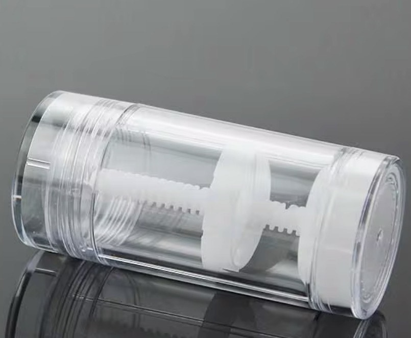

<html lang="en">
<head>
<meta charset="UTF-8">
<title>Get your fix with Chocostixx!</title>
<meta name="viewport" content="width=device-width, initial-scale=1.0">

</head>
<body>

<header>
    Get your fix with Chocostixx!  
     
    
</header>

<nav>
    <button onclick="showSection('home')">Home</button>
    <button onclick="showSection('shop')">Shop</button>
    <button onclick="showSection('cart')">Trolley</button>

    <!-- NEW BUTTON -->
    <button onclick="showSection('about')">About Us</button>
</nav>

<!-- HOME -->

    <h1 style="color:#6b3e18;">Welcome to Chocostixx.co.uk!</h1>
    
The official home of the world’s first twist up chocolate treat! Any queries or business interests: Email-harrytutton1@gmail.com

<!-- SHOP -->

    
Check out our range!

    

        

            
            
Original

            
£2.99

            <button class="add-btn" onclick="addToCart('Original Chocostixx', 2.99)">Add to Trolley</button>
        

        

            
            
Raspberry Ripple

            
£3.49

            <button class="add-btn" onclick="addToCart('Raspberry Chocostixx', 3.49)">Add to Trolley</button>
        

        

            
            
Caramel

            
£3.49

            <button class="add-btn" onclick="addToCart('Caramel Chocostixx', 3.49)">Add to Trolley</button>
        

    

<!-- ABOUT US -->

    <h1 style="color:#6b3e18;">About Us</h1>

    

        <!-- LEFT BOX TEXT -->
        

            <!-- 🔶 TYPE YOUR FIRST ABOUT TEXT HERE (LINE TO EDIT) -->
            Inspired on a bleak November Monday, Founder and CEO of Chocostixx.co.uk -Harry Tutton- sat and thought, how could he revolutionise the chocolate industry? How could he build a snack to eat now, to eat later, to be fun and flavourful, to combine food and design into one lip-smacking treat... And Chocostixx was born.
        

        <!-- RIGHT IMAGE -->
        <!-- 🔶 REPLACE THE FILENAME BELOW WITH YOUR PNG NAME -->
        

            
            

                Founder and CEO: Harry Tutton
            

        

    

    

        <!-- LEFT IMAGE -->
        <!-- 🔶 REPLACE THIS FILENAME WITH YOUR PNG NAME -->
        

            
            

                The Design
            

        

        <!-- RIGHT BOX TEXT -->
        

            <!-- 🔶 TYPE YOUR SECOND ABOUT TEXT HERE (LINE TO EDIT) -->
            He got to work and in 4 days, a website was built, a prototype created, market research collected that allowed him to understand what the people wanted. Witnessing the impact of litter in the local area, he implemented a policy, instead of the stixx tube being thrown away after the customer enjoys the snack, it would be returned for sterilisation and the customer would be paid back 50p allowing further chocostixx to be created keeping the small business thriving.
        

    

<!-- CART -->

    <h2 style="color:#6b3e18;">Your Trolley</h2>
    

    <h3 id="total" style="margin-top:20px;"></h3>

    <button id="payButton" onclick="startWonderfulPayment()">Pay Now</button>

</body>
</html>
